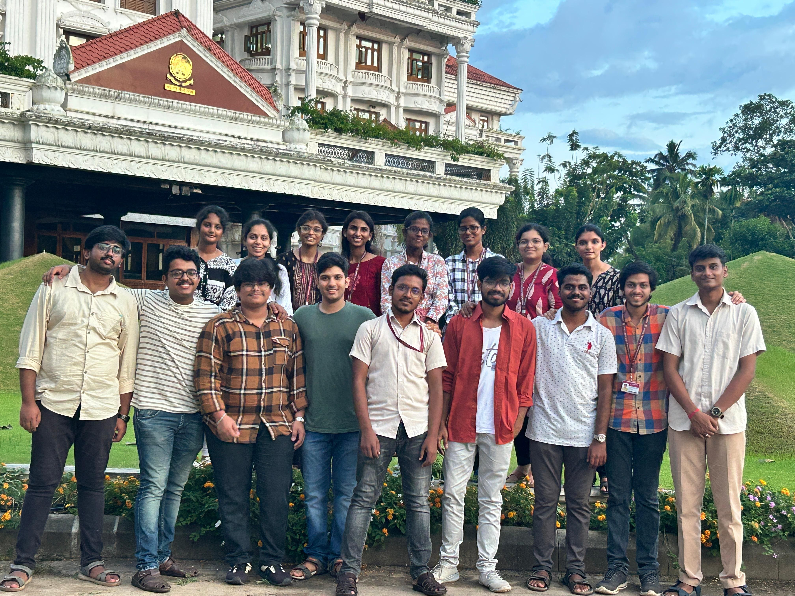

# The Robotics Club

Welcome to The Robotics Club, a student-run organization dedicated to advancing open-source projects in robotics and technology. Our mission is to foster collaboration, innovation, and learning through hands-on projects and shared knowledge.

## What We Do

- **Open-Source Projects:** We develop and contribute to various robotics and technology projects, promoting transparency and collaboration.
- **Learning & Workshops:** We conduct workshops and training sessions to help members enhance their skills and knowledge in robotics and programming.
- **Community Engagement:** We engage with the wider community through events, competitions, and collaborations with other organizations.

## Getting Involved

If you're interested in robotics and technology, we welcome you to join us! Check our ongoing projects, contribute to existing ones, or start your own.

## Code of Conduct

We believe in creating a respectful and inclusive environment for all members. Please read our [Code of Conduct](CODE_OF_CONDUCT.md) to understand our expectations.

## License

All projects under The Robotics Club are licensed under the [GNU General Public License v3.0 (GPL-3.0)](LICENSE).

## Contact

For inquiries or collaboration opportunities, please reach out to us at [trc.theroboticsclub@gmail.com].

---

Join us in shaping the future of robotics!
